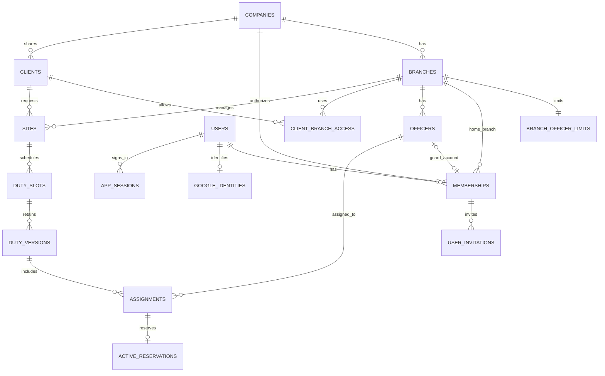

# 警備員管理システム 初回のデータ設計案

> 実装後の案内（2026年10月8日）: 初回機能は最新の依頼に基づき実装した。採用した推奨方式・実際の操作・接続設定・検証は [実装・運用手順](../IMPLEMENTATION.md) と [開発状況](../DEVELOPMENT.md) を参照。本資料の「今回は実装しない」「確認待ち」は草案作成時点の記録であり、未決事項をユーザーの確認済み回答へ変更したものではない。

作成日: 2026年10月7日（日本時間）

更新日: 2026年10月8日（日本時間）

版: 0.7

状態: Googleログイン専用を反映した論理設計の草案。現在の作業は要件整理と設計までで、実装には進まない

初回の隊員・現場管理、配置、本人の勤務予定表示を保存データで動かすために、データの関係、保存項目、会社境界、配置変更の扱いを整理する。現場の基本情報と日別の勤務を分け、確定した内容と編集中の内容を区別する。

機能の範囲と権限の基準は[初回実装の要件書](MVP_REQUIREMENTS.md)を参照する。交通誘導・施設警備、人数がそろってからの配置確定、4役割と担当拠点の基本範囲を確認済み。本店・各支店に初期登録枠10人を持たせ、担当者ごとにログインする。本店からの支店追加と拠点ごとの増枠は初回に課金しない。

追加回答により、支店追加と隊員登録枠の増加は本店所属の会社管理者だけに許可する。取引先は会社共通の1件を各拠点の現場から参照し、管制/閲覧者は所属拠点に関係する取引先だけを参照する。共有取引先の編集者は未決で、会社管理者だけを許可する案とする。拠点利用関係の保存方式と異動後の過去履歴閲覧は、確認済みの事実と分けて扱う。

本人認証はGoogleのOAuth 2.0 / OIDC専用とすることをユーザーに確認済み。内部利用者ID・所属・役割・隊員対応とアプリのセッションを保持し、利用者のパスワード・ハッシュ・MFA秘密・復旧コードは保持しない。認証方式と運用の境界は[Googleログイン設計](GOOGLE_AUTH_DESIGN.md)を参照する。

2026年10月8日の追加回答で、個人Gmail＋会社Google Workspaceを初回の許可対象とし、会社管理者のGoogle側二段階認証は必須、管制担当・閲覧者・警備員は推奨に確定した。アプリセッションは全役割共通で本人操作なし24時間・ログインから最長1か月。確認・強制実装方法等の未決部分は6.1・6.2に分ける。

続く回答で、招待は会社管理者が登録した本人Googleメール宛てのリンク、発行から7日間・一度限り、再招待で旧リンク無効に確定した。Google連携変更は本人確認後に会社管理者が承認し、管理者自身は別管理者、ほかにいなければ運営者が承認する。変更時は旧連携/全アプリセッションを無効にし新招待を発行する。最初の会社管理者登録と全管理者ログイン不能時の復旧/交代は運営者が会社・本人を確認して対応する。

現在はDB接続と`GET /api/health`だけが実装されている。この資料に記載する業務テーブル・制約・RLS・認証は未実装であり、既存DBへの変更は行わない。

2026年10月8日のユーザー指示により、以下の実装手順は将来の計画として整理する。マイグレーション・業務API・認証等の実装開始は、別途の依頼を受けてから行う。

## 1 データを分ける単位

| 単位 | 保存するもの | 分ける理由 |
| --- | --- | --- |
| 会社と拠点 | 会社、拠点、利用者の所属と操作範囲 | 他社のデータを取得・変更させず、担当拠点の範囲を適用する |
| 本店と支店 | 会社に1つの本店と、本店から追加する支店 | 本店の管理機能から自社の支店を1拠点ずつ増やせる |
| 登録枠 | 本店・各支店それぞれの初期上限10人、増枠の値と変更履歴 | 拠点別に上限を管理し、同時登録でも上限を超えないようにする |
| 利用者と隊員 | ログインする人と、業務上の警備員の情報 | アカウントのない隊員も登録でき、退職・利用停止と業務履歴を分けられる |
| 利用者とGoogle連携 | 内部利用者と、検証済みのGoogleの`iss`・`sub`の対応 | メール変更や同姓同名を本人識別や会社権限の根拠にしない |
| 招待とセッション | 初回連携の対象・期限・一回限りの利用と、アプリのログイン状態 | Googleの資格情報と、業務上の招待・アクセス停止を分ける |
| 取引先と現場 | 依頼元の情報と、実際に警備する場所の情報 | 1つの取引先に複数の現場を関連付ける |
| 現場と勤務枠 | 現場の基本情報と、日別・勤務帯別の仕事 | 同じ現場に日勤・夜勤や異なる人数の勤務を登録できる |
| 勤務枠と版 | 同じ勤務を識別する枠と、改訂ごとの内容 | 確定した内容を表示したまま、変更案を編集できる |
| 版と配置 | その版の勤務日時・指示と、配置した隊員 | 隊員の入替えを含む過去の確定内容を残せる |

### 1.1 主なデータの関係

この図は初回の「1社・1所属拠点・1役割」の案を表す。実際の会社境界は各業務テーブルの会社IDでも確認する。管制担当に複数拠点を許可する場合は、所属拠点と操作できる拠点を分ける関連テーブルを追加する。

取引先は会社共通の1件とし、各拠点の現場から同じIDを参照する方式を確認済み。`clients`に`branch_id`を設けず、`sites.branch_id`は維持する。管制/閲覧者の参照を所属拠点に関係する取引先へ限定するため、会社管理者が取引先と拠点の利用関係を明示登録する`client_branch_access`を設ける技術案とする。現場ゼロの拠点でも、有効な利用関係があれば新規現場の取引先候補を取得でき、所属拠点と関係のない会社共通取引先を無条件に公開しない。共有取引先本体の編集者はユーザー確認待ちで、会社管理者のみの案を置く。

## 2 共通の保存形式

| 項目 | 設計案 |
| --- | --- |
| 内部ID | UUIDを使う。隊員番号・現場コード等の画面上の番号とは分ける |
| 会社ID | 会社に属するすべての業務データに`company_id`を必須で持たせる。利用者が自由に決める値にしない |
| 拠点ID | 隊員・現場・勤務枠に`branch_id`を持たせる。各拠点が同じ会社に属することを確認する |
| 日付と日時 | 日付は`date`、勤務の開始・終了は`timestamptz`。入力・表示は日本時間、勤務日は開始日時の日本時間の日付 |
| コードと人数 | コードは会社内で一意。人数は整数で1以上。氏名・現場名・取引先名の一致だけで同じデータと判定しない |
| 更新情報 | 更新可能な基本情報と下書きに、作成日時・更新日時・操作者・更新番号を持たせる |
| 状態 | 定義した状態だけを許可する。自由入力の状態文字列を受け付けない |
| 削除 | 業務画面からの物理削除は初回対象外。履歴を維持する状態変更を使い、保存期間に応じた整理は管理手順で行う |

会社IDと内部IDの組を関連付けのキーに使い、A社の配置にB社の隊員や現場を指定することをDBでも拒否する。UUIDだけを採用しても、会社境界の確認は必要になる。

## 3 保存する項目

必須・任意は初回の案とする。会社ID・内部ID・作成更新情報等の共通項目は表中で繰り返さない。入力の文字数上限、メール等の形式、検索期間の上限はAPI仕様に定める。

### 3.1 会社と利用者

| テーブル案 | 必須項目 | 任意項目と補足 |
| --- | --- | --- |
| `companies` | 会社コード、会社名、利用状態 | 初期会社の作成は管理用手順。自由な公開登録は初回対象外 |
| `branches` | 拠点コード、拠点名、本店・支店の種別、利用状態 | 業務連絡先。拠点コードは会社内で一意。本店は会社に1つとし、支店は本店機能から追加する |
| `users` | 内部利用者ID、表示名、利用状態 | 業務主体を識別するUUID。Googleのメールや氏名を主キーにしない。事前登録時点ではGoogle連携なしで保持できる |
| `google_identities` | 利用者ID、正規化した検証済み`issuer`（`iss`）、`subject`（`sub`）、連携日時 | Googleメール・`email_verified`・検証済み`hd`は必要な表示/確認用の補助情報。メールを一意キー・自動連携条件にしない。`(issuer, subject)`は全体で一意、初回は1利用者に1つのGoogle連携 |
| `company_memberships` | 利用者ID、所属拠点ID、役割、有効状態、権限更新番号 | 警備員役割では隊員IDを必須とする。初回は1利用者につき1社、1役割の案 |
| `user_invitations` | 対象利用者/所属ID、登録した本人Googleメール、トークンのハッシュ、発行日時、発行から7日後の期限、状態、作成者 | 本人確認の方法/日時、使用/無効化日時、取消理由、再招待前の参照。招待リンクを本人Googleメール宛てに送り、再招待で旧リンクを無効にする。会社・拠点・役割・隊員対応は事前登録を使い、コールバック入力で変更させない |
| `app_sessions` | 利用者ID、ランダムなセッション識別子のハッシュ、権限改訂番号、作成・最終本人操作・絶対期限・失効日時 | 全役割共通で本人操作なし24時間・最長1か月。時刻は`timestamptz`でUTCの瞬間を保存する。Cookieの値を平文でDB・監査・ログに保存しない。Googleのトークンをセッション識別子にしない |

同じ隊員に複数の警備員用アカウントを関連付けない。会社管理者が隊員との対応を設定し、同じ会社・所属拠点であることを確認する。管制・管理者が警備員業務を兼任する場合の役割は、権限確認後に決める。

本店の拠点レコードは会社に1つとし、担当者ごとに個別の利用者を事前登録・招待する。Googleアカウントの作成は本人またはGoogle Workspace管理者がGoogle側で行い、業務利用者の事前登録と区別する。会社管理者を1名に限定する制約は設けない。隊員の登録枠10人を、会社管理者・管制担当・閲覧者のアカウント数の上限には使わない。

パスワード・パスワードハッシュ・TOTP秘密・MFA復旧コード・パスワード再設定トークンのテーブル/列は作成しない。GoogleのAuthorization Code・IDトークン・アクセストークンはログイン処理中だけ扱い、通常業務API・監査・ブラウザの`localStorage`へ出さない。Google APIを利用しない初回範囲ではリフレッシュトークンを要求・保存しない。OAuthクライアント秘密は利用者の資格情報とは別のサービス秘密として保管する。

OIDCの一時処理には`state`・`nonce`・PKCE verifier・期限・一回限りの状態・ログイン開始ブラウザとの対応を持つ短命のサーバー側記録を設計する。招待に関する補助情報と復帰先はサーバー側で保持し、許可した同一オリジンのアプリ内パスだけを復帰先に使う。短命記録の保管先・削除期限は実装時に確定する。セッションと招待を含む認証用テーブルは業務テーブルと権限・API経路を分け、通常の業務APIに秘密情報を返さない。

Googleが許容する`iss`表現を検証後に固定のissuer（`https://accounts.google.com`）へ正規化し、Googleが本人の不変識別子として提供する`sub`との組で検索する。招待を消費する処理と初回Google連携作成は同じトランザクションで行い、一意制約と排他によって招待再使用・別利用者への重複連携を拒否する。Googleメール変更は補助情報の更新にとどめ、別の利用者や別会社へ自動で付け替えない。

招待トークンは暗号学的に安全な推測不能乱数から生成し、ハッシュのみを保存する。発行日時をサーバー時刻で記録し、期限は発行から7日（168時間）後の瞬間としてUTCで保存する設計案。現在時刻が期限以上なら拒否し、再招待では旧招待の無効化と新招待の発行を同一トランザクションで行う。再招待と旧リンク使用が競合しても、最新の招待状態を保存直前に確認する。送信状態と使用状態を分け、不達・誤宛先・配送の再試行手順は別途具体化する。

初回はGoogle本人認証に加えて招待対象の検証が必要。署名・issuer等を検証したIDトークンの`email_verified`が真であり、個人Gmailまたは`hd`がある会社Google Workspaceだけを対象にする。非Gmailかつ`hd`なしの外部メールGoogleアカウントは、`email_verified`が真でも初回は拒否し、追加本人確認を行う対象にはしない。外部メールを将来許可する際は別途追加確認を設計する。`hd`やメールドメインから会社所属・役割を付与せず、招待と内部所属で決定する。会社側の管理ドメイン一致ルールはQ09で具体化する。

Google連携変更は会社管理者が本人を確認して承認する。変更対象が会社管理者本人の場合は同じ会社の別の会社管理者が承認し、ほかにいなければ運営者が承認する。承認後は旧Google連携を現在の本人解決対象から外し、全アプリセッションを失効し、新しい本人Googleメールへの7日間の招待を発行する。変更対象と承認者のID・本人確認の方法/日時・理由・結果・新招待との対応を記録し、通常のメール編集で連携変更を実行させない。旧連携の無効化・全セッション失効・新招待・監査は整合させ、内部利用者IDと業務履歴を維持する。申請/承認の保存表現と本人確認の詳細は実装時に具体化する。

最初の会社管理者登録と、全会社管理者がログイン不能となった場合の復旧/管理者交代は、運営者が会社・本人を確認する限定手順で行い、操作者・対象会社/利用者・確認結果・変更理由を記録する。一般公開の登録や救済パスワードで代替しない。Googleパスワード回復はGoogle側に案内し、アプリの連携変更や役割交代と区別する。

### 3.2 隊員と資格

| テーブル案 | 必須項目 | 任意項目と補足 |
| --- | --- | --- |
| `officers` | 隊員番号、氏名、所属拠点ID、在籍状態 | 業務電話・業務メール、雇用区分、対応エリア、配置上の注意。連絡先の必須条件は試験運用の連絡手段に合わせる |
| `qualifications` | 会社で利用する資格コード、名称、利用状態 | 会社が確認した資格の分類。サンプル文字列から正式な資格基準を自動生成しない |
| `officer_qualifications` | 隊員ID、資格ID、確認状態 | 確認者・確認日時、有効期間がある場合の開始終了日。初回は証明書添付を保存しない |

在籍状態は既存モックと対応させて`active`（在籍）、`leave`（休職）、`retired`（退職）とする案。資格の確認状態は未確認・確認済み・無効を区別する。

業務連絡先、資格の確認情報、管制用メモは公開範囲が異なる。取得する項目をAPIで役割別に選び、警備員には本人の情報だけ、閲覧者には基本情報と資格の概要だけを返す。任意の自由記述には、初回の収集対象外の情報を入力しない運用にする。

### 3.3 本店による登録枠の管理

本店・各支店に独立した初期上限10人を持たせ、本店所属の会社管理者だけが対象拠点の上限を増やせる。支店追加も本店所属の会社管理者だけに許可し、その支店の枠を10人で作成する。役割・有効所属・所属拠点の本店種別をサーバーで確認し、支店所属の会社管理者を拒否する。ある拠点を増枠しても別拠点の上限は変えず、警備員の登録数とログイン用アカウント数は別に数える。

| テーブル案 | 必須項目 | 制約と補足 |
| --- | --- | --- |
| `branch_officer_limits` | 会社ID、拠点ID、上限値、更新番号、作成日時、更新者、更新日時 | 拠点ごとに1行。初期上限10、更新番号1。会社IDと拠点IDの組で同じ会社の拠点を参照する |

拠点と登録枠を同じトランザクションで作成し、枠のない拠点を残さない。上限値は10以上の整数とし、初回は増加のみを対象とする。現在の人数は対象拠点の在籍・休職中の隊員から数え、退職者は履歴を維持して枠から除く。アカウントの利用停止だけでは隊員の在籍状態を変えず、枠からも除かない。

隊員の新規登録、退職者を在籍・休職に戻す操作、拠点への異動は対象の枠をロックして同じトランザクションで人数を確認する。たとえば残り1枠に対する同時登録があっても、両方を登録しない。枠を増やす操作には会社境界と本店所属会社管理者の条件を適用し、変更前後の上限を履歴に残す。

支店追加・増枠は初回に課金しない。初回の保存項目に決済・購入状態を設けず、将来課金を導入する場合は契約上の利用枠と拠点上限の関係を別途設計する。

### 3.4 取引先と現場

| テーブル案 | 必須項目 | 任意項目と補足 |
| --- | --- | --- |
| `clients` | 取引先コード、取引先名、利用状態 | 会社共通の1件。共通項目の`company_id`を持ち、`branch_id`を持たない。業務窓口名・業務連絡先。登録編集者は会社管理者のみの案・ユーザー確認待ち |
| `client_branch_access` | 会社ID、取引先ID、拠点ID、有効状態、更新番号 | 所属拠点との関係を表す技術案。`(company_id, client_id, branch_id)`は一意。会社ID付き複合外部キーで取引先/拠点の同社所属を確認。会社管理者が利用拠点を登録する案 |
| `sites` | 現場コード、名称、所属拠点ID、取引先ID、警備種別、現場の場所、状態 | 集合場所、業務連絡先、標準の勤務指示、配置条件、契約開始日・終了日、管制用メモ |

会社管理者は自社の取引先全体を参照でき、管制/閲覧者の一覧・詳細・候補・件数は所属拠点の有効な`client_branch_access`だけを使う技術案。本人に公開していない拠点の関係/現場一覧/件数を応答へ混ぜない。現場の登録時は、`sites.company_id`と`client_id`の同社外部キーに加え、現場の所属拠点と取引先の有効な利用関係をAPI/DBの保存時に確認する。現場作成と利用関係の無効化が同時でも古い関係を根拠に保存しない。利用関係の解除時の既存現場・異動後の過去履歴の扱いは未決であり、履歴を自動で他拠点へ移さない。

現場状態は`planned`（準備中）、`active`（稼働中）、`paused`（休止中）、`closed`（終了）とする案。契約期間を入力する場合は開始・終了の両方を持たせ、終了が開始より前になることを拒否する。契約終了日は日本時間のその日を含む日付として扱う。

現場には標準の勤務条件を持たせられるが、実際の勤務時間・必要人数・確定隊員は勤務枠とその版に保存する。現場の基本情報を変更しても、確定済み勤務の集合場所や指示を自動で上書きしない。

### 3.5 日別の勤務と配置

| テーブル案 | 必須項目 | 任意項目と補足 |
| --- | --- | --- |
| `duty_slots` | 現場ID、所属拠点ID、状態、更新番号 | 現在の公開版ID。公開版と勤務枠の会社・対応関係を検証する |
| `duty_versions` | 勤務枠ID、版番号、版の状態、勤務日、開始日時、終了日時、必要人数、現場名・集合場所・指示等の公開内容 | 確定者・確定日時、改訂・超過配置・取消等の理由、勤務可能と移動・休息の確認記録 |
| `duty_qualification_requirements` | 版ID、資格ID、必要な資格保有人数 | Q06の確認後に条件を確定する。詳細な業務別判定は初回対象外 |
| `assignments` | 版ID、隊員ID、責任者の指定 | 版内で同じ隊員を重複させない。公開時の隊員名等、履歴に必要な表示内容を保持する |
| `active_reservations` | 現在有効な配置ID、勤務枠ID、版ID、隊員ID、開始終了日時 | 有効な公開配置だけの重複防止用データ。過去の配置履歴は`assignments`に残す |

勤務枠の状態は下書き・確定・取消、版の状態は下書き・公開中・旧版・取消とする案。1勤務枠の現在の公開版は最大1つ、編集中の下書き版も最大1つとする。

必要人数と資格保有人数は区別する。たとえば「隊員3名、そのうち登録資格を確認済みの隊員が1名以上」という条件を表せる構造とし、全員に同じ資格を要求する条件へ自動変換しない。実際に採用する条件と選任方法はQ06で確認する。

人数がそろってから確定するルールを確認済み。人数不足の版は下書きに残し、確保した隊員だけを先に確定・公開しない。必要人数と配置人数を別々に保持し、不足人数は計算する。下書き版と公開版の人数を合算しない。

### 3.6 履歴と再送の管理

| テーブル案 | 保存する内容 | 制限 |
| --- | --- | --- |
| `audit_events` | 会社・拠点・操作者・対象ID・操作・結果・日時・変更理由・許可された変更前後の項目・リクエストID | 通常APIは追記と認可された閲覧のみ。更新・削除を許可しない。認証情報・セッション識別子・秘密情報を保存しない |
| `idempotency_records` | 会社・操作者・操作種別・再送識別子・入力の識別用ハッシュ・処理状態・結果の参照先 | 同じ入力の再送を二重実行しない。同じ識別子で入力を変えた場合は拒否し、再取得時にも現在の権限を確認する |

履歴にも会社・拠点・項目別の閲覧制限を適用する。資格詳細や内部メモが、一般の変更履歴から漏れないようにする。保存期間と管理者による整理方法はQ10で決める。

## 4 DBとAPIで守る条件

### 4.1 関連データと入力の整合性

| 条件 | 実装時の方針 |
| --- | --- |
| 別会社のデータを関連付けない | 各業務テーブルに`UNIQUE (company_id, id)`を用意し、会社IDを含む複合外部キーで参照する |
| 初回の拠点範囲を守る | 現場と会社共通取引先の同社所属、現場所属拠点との有効な`client_branch_access`を確認する。配置時は勤務枠と隊員の所属拠点をAPIで確認する。過去配置を現在の隊員所属へ移さず、異動後の履歴閲覧範囲はユーザー回答後に確定する |
| 隊員番号・版・配置の重複を防ぐ | 隊員番号は会社内、版番号は勤務枠内、隊員は版内で一意にする。アカウントと隊員の対応にも一意制約を設ける |
| 勤務日時と人数を検証する | 終了が開始より後、必要人数が1以上、勤務日が開始日時の日本時間の日付と一致することを確認する |
| 公開版と有効配置を一致させる | 有効予約の配置・版・隊員・勤務枠・日時を照合する。別版の日時や下書きの配置を有効予約にできない確定用の処理をDB側にも設ける |
| 終了後の訂正を区別する | 通常の確定処理で過去の勤務を新規公開しない。必要な訂正はQ10で定める管理者用の手順に分ける |

複数行や別テーブルの条件は、単純な`CHECK`だけで保証する設計にしない。外部キー・一意制約と、必要なロックを使う確定処理を組み合わせる。[PostgreSQLの制約](https://www.postgresql.org/docs/18/ddl-constraints.html)

### 4.2 会社ごとのデータ分離

共有DB・共有テーブルに会社IDを持たせ、APIの認可に加えて業務テーブルにPostgreSQLの行単位制御であるRLSを適用する案とする。会社コンテキストが設定されていなければ、業務データを取得・変更できないようにする。

認証済み利用者の有効な所属から会社を確認し、同じDB接続のトランザクション内だけに会社コンテキストを設定する。API用の接続ロールはテーブル所有者・スーパーユーザー・`BYPASSRLS`にせず、対象テーブルで必要な`FORCE ROW LEVEL SECURITY`を確認する。会社境界はRLS、拠点・本人・項目の範囲はAPIの認可でも確認する。[PostgreSQLの行セキュリティ](https://www.postgresql.org/docs/18/ddl-rowsecurity.html)

認証前のGoogleコールバック・セッション解決は会社IDだけで利用者を選べる通常業務APIにしない。GoogleのIDトークン検証と許可アカウント条件の確認、専用のDB権限を使って`iss`・`sub`の対応を解決し、本人確認後に有効な会社所属を読み取る。未連携なら有効な招待と対象本人を確認し、未招待を拒否する。セッション期限・所属変更・利用停止を確認した後で業務トランザクションを開始する。

会社コンテキストは接続全体に残さず、コミット・ロールバック後の接続再利用で混ざらないことを検証する。接続プールは既存の`pg`を使い、トランザクション途中に別の接続へ処理を移さない。

### 4.3 同時確定と時間重複

有効予約に対して、同じ会社・隊員の勤務時間が重なることを拒否する排他制約を使う案とする。時間範囲は開始を含み終了を含まない`[開始, 終了)`とし、夜勤も開始・終了の両日を使う。PostgreSQLの範囲型と排他制約、UUID等の比較に`btree_gist`を利用する。[範囲型と排他制約](https://www.postgresql.org/docs/18/rangetypes.html#RANGETYPES-CONSTRAINT)、[btree_gist](https://www.postgresql.org/docs/18/btree-gist.html)

配置確定は次の内容を1つのトランザクションで行う。

1. 操作者の現在の権限、勤務枠の更新番号、対象隊員の状態を確認し、勤務枠と隊員を一定の順序でロックする。
2. 人数、責任者、登録資格、勤務可能確認、他の有効な勤務との重複を再確認する。
3. 改訂の場合は旧版の有効予約を解除し、新版の有効予約を作成する。重複等で失敗した場合は旧版の解除もロールバックする。
4. 旧版・新版の状態と公開版IDを更新し、履歴と再送管理の結果を保存する。
5. 全体をコミットする。本人向け表示は公開版と有効配置から取得する。

同じ勤務枠の同時編集は更新番号で検出する。資格・在籍状態の変更と確定が同時に行われる場合も、同じ隊員をロックして条件確認と変更が競合しないようにする。公開済みの版を編集せず、訂正は新しい版で残す。

## 5 既存のモックとの対応

| 既存の項目 | 保存データでの扱い |
| --- | --- |
| 隊員ID`G004`等 | 内部IDとは分け、会社内の隊員番号として扱う |
| 現場ID`S002`等 | 内部IDとは分け、会社内の現場コードとして扱う |
| 現場の`hours`・`required`・配置隊員 | 日別の勤務版と配置へ移す。時刻の表示文字列をDBの勤務時間として保存しない |
| `Officer.assignment` | 隊員マスタの単一項目にせず、対象日の有効配置から取得する |
| `qualifications`の文字列配列 | 資格マスタとの関連と確認状態へ分ける。正式な分類・条件は会社に確認する |
| 現場・取引先の名称による関連 | IDの外部キーで関連付け、名称変更や同名の取引先があっても混同しない |
| 本日の人数・不足件数 | 対象日の公開版・有効配置から集計し、下書きの不足は別に表示する |
| 未読件数・教育予定・勤怠件数 | 初回対象外。保存データに基づく実際の件数と混在させない |

サンプルの基準日は2026年10月4日のままにする。開発用の架空データと実際の登録データは別の環境・経路で扱い、固定サンプル利用者を実データの本人識別に使わない。

既存のモックの隊員40名は表示サンプルとして保持する。拠点ごとに初期登録枠10人を使う開発用DBでは、各拠点の枠以内の初期データを用意する。既存40名をそのまま1拠点へ初期投入して上限を迂回せず、その拠点で10人を超える検証は増枠操作を通して行う。

## 6 設計から実装へ進める順序

| 段階 | 作業 | 着手条件と確認結果 |
| --- | --- | --- |
| 1 | 対象業務、配置確定、基本権限を反映し、本店と登録枠を具体化する | Q02〜Q05とQ11〜Q13を確認済み。拠点ごとの登録枠・個別ログイン・初回課金なしを反映。在籍・休職を算入し、退職者は履歴を残して枠から除く |
| 2 | 資格条件・現場責任者・本人向け現場情報の閲覧期間を確認し、データ項目を確定 | Q06・Q07を反映する。既存の連絡手段による案内はQ08で確認する |
| 3 | Google認証・セッションとDB分離の詳細を設計する | 許可対象、役割別MFA、セッション期限、本人Googleメール宛て7日間の招待/再招待、連携変更承認者、運営者の初期/全管理者ログイン不能時対応は確定済み。Q09の本人確認詳細、会社管理ドメイン一致、配信/不達/誤宛先、承認処理の保存と競合、MFA確認/強制と`amr`欠落時、本人操作識別を具体化する。費用が発生する構成は選定前に確認する |
| 4 | 会社・拠点・利用者・業務マスタのマイグレーションと認可を実装 | API用とマイグレーション用の権限を分け、2社・複数拠点・役割別に取得と更新を検証する |
| 5 | 隊員・取引先・現場の登録更新をAPIと画面へ接続 | 再読み込み後の保存内容、認可、必須入力、競合、変更履歴を確認する |
| 6 | 勤務枠・版・配置・有効予約を実装し、本人の予定へ接続 | 人数不足・夜勤・同時確定・改訂失敗時の復元・取消後の閲覧制限を確認する |
| 7 | 試験運用の準備 | 通知の代替手順、終了済み予定の訂正、保存期間等を確認し、Q08・Q10とセキュリティチェックリストの該当項目を満たす |

業務用テーブルはマイグレーションで管理する。現在の初期化スクリプトはAPI用ロールに全テーブルの更新・削除を許可する設定があるため、履歴テーブル等を追加する際はテーブル別の必要権限へ見直す。これを現在すでに適用済みの権限設定として扱わない。

### 6.1 Googleログインの設計方針

全利用者の本人認証はGoogleのOAuth 2.0 / OIDC専用に確定した。HonoサーバーでAuthorization CodeフローとPKCE（S256）・`state`・`nonce`を使い、スコープは`openid email`に限定する設計案とする。サーバーでコードを交換し、IDトークンの署名・`iss`・`aud`・`exp`・`nonce`を検証してから、3.1のGoogle連携と有効な所属を解決する。Googleメールで既存利用者を自動検索して連携しない。[Google OpenID Connect](https://developers.google.com/identity/openid-connect/openid-connect)、[サーバー側の検証](https://developers.google.com/identity/sign-in/web/backend-auth)

アプリには推測不能なCookieセッションを発行し、`HttpOnly`・`Secure`・`SameSite=Lax`を本番で必須とする。Googleのログイン状態とアプリのセッション期限・停止は別に扱い、各業務リクエストで所属・役割・停止を再確認する。Google側の回復やパスワード変更をアプリの全端末失効の代替にしない。

MFAとGoogleアカウントの回復はGoogle側で行う。会社管理者のGoogle側二段階認証は必須、管制担当・閲覧者・警備員には推奨する方針を確認済み。OIDC認証成功だけでMFAの実施・設定を保証できるとは扱わない。確認・強制方法、Googleが返す検証情報の利用可能性と`amr`欠落時の扱いはQ09で具体化し、実証前に管理者のMFA要件を実装済みとしない。アプリ独自のTOTP登録やバックアップコードは設けない。

会社への所属や管理者の役割は一般の新規Googleログインやメールドメインから取得できない構成にし、会社管理者が事前登録・招待した利用者だけを対象の確認後に有効にする。最初の会社管理者は運営者が会社・本人を確認して事前登録し、Google本人認証と招待確認で連携する。全管理者ログイン不能時も運営者の会社・本人確認による復旧/交代手順を使う。既存のOrigin・CSRF・入力制限を維持し、GoogleからのGETコールバックだけに必要な経路を限定して`state`等を検証する。[Googleログイン設計](GOOGLE_AUTH_DESIGN.md)を実装時の統合基準とする。

### 6.2 確定したセッション期限の保存と判定

全役割で本人操作なし24時間と、ログイン完了から最長1か月の早い期限を適用する。ログイン完了時のサーバー時刻で作成日時と最終本人操作日時を初期化し、絶対期限を一度だけ算出する。本人操作として扱うAPI/画面イベントと、サーバー側での判別方法は実装時に具体化し、クライアントが送る日時で期限を決めない。

1か月は日本時間のログイン完了日時から翌月の同日時とし、該当日がなければ月末の同時刻へ補正する技術案。例: 2026年10月31日09:00は11月30日09:00まで。日本時間で算出後、作成・最終本人操作・絶対期限をUTCの瞬間として保存する。30日固定や端末のタイムゾーンを使う計算にはしない。

各リクエストで、サーバーの現在時刻が最終本人操作日時＋24時間以上、または絶対期限以上なら拒否し失効させる。期限の検証後に、認可された本人操作だけで最終本人操作日時を更新する。自動ポーリング・自動再取得・バックグラウンド通信は更新しない。通常操作やCookie更新で絶対期限を延長せず、期限切れセッションを後から操作で復活させない。同時の本人操作・ポーリング・失効でも保存時に最新状態を確認する。

## 7 実装時に検証する具体例

- A社の利用者がB社の隊員・現場・版のIDを指定しても取得・関連付けできない。エラーから他社の記録の有無も分からない。
- 管制担当が許可範囲外の拠点に登録・確定できず、警備員は本人以外の勤務や非公開項目を取得できない。
- 10月4日22:00〜10月5日06:00の隊員を、10月5日05:00開始の勤務へ同時確定できない。
- 改訂の確定が重複で失敗した場合、旧版の勤務予定と有効予約が両方とも維持される。
- 配置の取消後も過去の版と取消理由を追跡でき、本人には取消済みの概要だけが表示される。
- 人数不足時の確定はQ03で選んだルールになり、下書きと公開版の人数が合算されない。
- 同じ確定操作の再送は二重登録にならず、同じ再送識別子で異なる入力を送った場合は拒否される。
- 退職・利用停止・権限縮小後の次の取得・更新は旧権限で実行できず、同じDB接続を別会社に再利用してもデータが混ざらない。
- API用DBロールではRLSを迂回できず、監査記録の書換え・削除やテーブル作成が拒否される。
- 本店と各支店に独立した初期登録枠10人を適用し、各拠点の上限への同時登録を制限する。増枠は自社の本店所属会社管理者だけが課金なしで実行でき、別拠点の上限は変わらない。
- 支店追加/増枠を本店所属会社管理者だけが実行でき、支店所属管理者・別会社・他役割の直接API操作を拒否する。所属変更後の次の操作にも本店条件を適用する。
- 会社共通の1件の取引先を複数拠点から参照し、所属拠点との有効な利用関係がある管制/閲覧者だけが一覧・詳細・候補・件数を取得できる。現場ゼロでも利用関係があれば候補取得でき、無関係の取引先/他拠点現場/他社の関連付けを拒否する。本体の編集者と異動後の過去履歴閲覧の受入は回答後に確定する。
- 本店に複数の担当者を事前登録・招待しても、本店の拠点レコードは1つのままであり、隊員の登録枠が担当者アカウントの数に使われない。
- 休職中も登録枠に含め、退職にすると履歴を維持したまま枠から除く。上限に達した拠点で退職者を在籍へ戻す場合は拒否される。
- 未招待・期限切れ・使用済み・別本人の招待をGoogle認証成功だけでは有効化せず、同時の初回連携でも1回だけ成立する。
- 本人Googleメールへの招待が発行から7日後の期限ちょうどで無効となり、再招待後に旧リンクを使えない。再招待と旧リンクの同時消費を整合させ、招待秘密をDB・ログに平文保存しない。
- Google連携変更の会社管理者による本人確認/承認、管理者自身の変更を別管理者（ほかにいなければ運営者）が承認する条件と自己承認拒否を確認する。変更後は旧連携/全アプリセッションで入れず、新招待だけが利用できる。最初の管理者登録と全管理者ログイン不能時の復旧/交代に運営者の会社・本人確認と記録がある。
- Googleメールが変わっても検証済み`iss`・`sub`で同じ本人を解決し、同じメールを持つ別`sub`へ自動連携しない。`email_verified`が真でないGoogleアカウント、非Gmailかつ`hd`なしの外部メールは初回に拒否する。`hd`をURL入力や未検証JWTから採用せず、会社所属の自動付与にも使わない。
- 不正な署名・issuer・audience・期限・nonce・state・PKCE、認証コード再使用、開いた画面を使った復帰先の改ざんを拒否する。認証情報を通常API・監査・ログ・`localStorage`へ出さない。
- パスワード・ハッシュ・TOTP秘密・復旧コードの保存列とローカル認証経路がないこと、停止・紐付け変更後の旧セッションが無効であることを確認する。Googleの認証成功をMFA実施の確認として扱わない。
- 会社管理者のGoogle側二段階認証必須と他3役割の推奨を区別し、採用するMFA確認/強制方法を実証する。`amr`欠落をMFA実施済みとして扱わず、その扱いを着手前に確定する。
- 最終本人操作から24時間の直前は有効、ちょうど24時間で拒否する。自動ポーリングでは期限を更新しない。暦月の絶対期限、該当日のない月末、期限直前の本人操作と同時失効を確認し、絶対期限を延長・復活させない。

これらは今後の実装検証項目であり、現在の常設テストや確認済みの結果ではない。

## 8 関連資料

- [初回実装の要件書](MVP_REQUIREMENTS.md)
- [Googleログイン設計](GOOGLE_AUTH_DESIGN.md)
- [開発状況と実装ガイド](../DEVELOPMENT.md)
- [APIとDBの既存対策](../../SECURITY.md)
- [セキュリティチェックリスト](../SECURITY_CHECKLIST.md)
- [管理者向け業務フロー](../workflows/admin-workflows.md)
- [警備員向け業務フロー](../workflows/guard-workflows.md)
