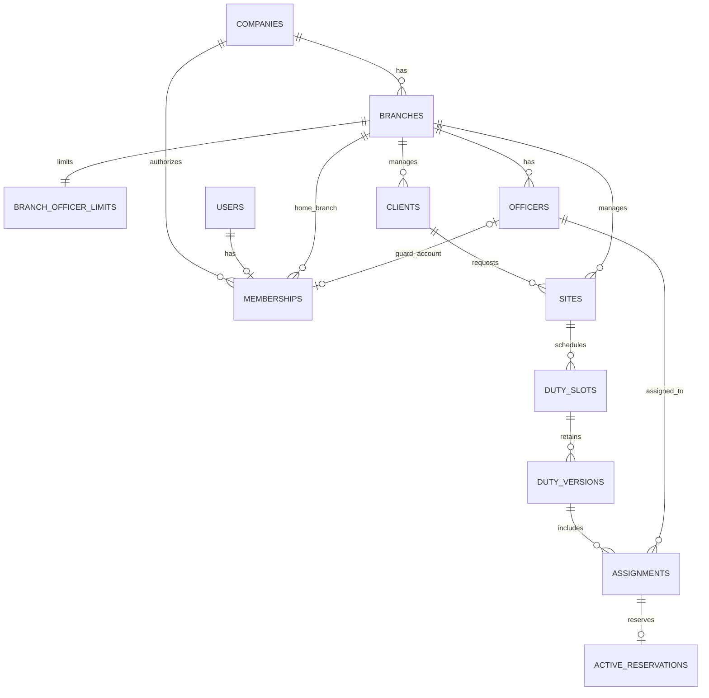

# 警備員管理システム 初回のデータ設計案

作成日: 2026年10月7日（日本時間）

更新日: 2026年10月8日（日本時間）

版: 0.4

状態: 論理設計の草案。現在の作業は要件整理と設計までで、実装には進まない

初回の隊員・現場管理、配置、本人の勤務予定表示を保存データで動かすために、データの関係、保存項目、会社境界、配置変更の扱いを整理する。現場の基本情報と日別の勤務を分け、確定した内容と編集中の内容を区別する。

機能の範囲と権限の基準は[初回実装の要件書](MVP_REQUIREMENTS.md)を参照する。交通誘導・施設警備、人数がそろってからの配置確定、4役割と担当拠点の基本範囲を確認済み。本店・各支店に初期登録枠10人を持たせ、担当者ごとにログインする。本店からの支店追加と拠点ごとの増枠は初回に課金しない。

現在はDB接続と`GET /api/health`だけが実装されている。この資料に記載する業務テーブル・制約・RLS・認証は未実装であり、既存DBへの変更は行わない。

2026年10月8日のユーザー指示により、以下の実装手順は将来の計画として整理する。マイグレーション・業務API・認証等の実装開始は、別途の依頼を受けてから行う。

## 1 データを分ける単位

| 単位 | 保存するもの | 分ける理由 |
| --- | --- | --- |
| 会社と拠点 | 会社、拠点、利用者の所属と操作範囲 | 他社のデータを取得・変更させず、担当拠点の範囲を適用する |
| 本店と支店 | 会社に1つの本店と、本店から追加する支店 | 本店の管理機能から自社の支店を1拠点ずつ増やせる |
| 登録枠 | 本店・各支店それぞれの初期上限10人、増枠の値と変更履歴 | 拠点別に上限を管理し、同時登録でも上限を超えないようにする |
| 利用者と隊員 | ログインする人と、業務上の警備員の情報 | アカウントのない隊員も登録でき、退職・利用停止と業務履歴を分けられる |
| 取引先と現場 | 依頼元の情報と、実際に警備する場所の情報 | 1つの取引先に複数の現場を関連付ける |
| 現場と勤務枠 | 現場の基本情報と、日別・勤務帯別の仕事 | 同じ現場に日勤・夜勤や異なる人数の勤務を登録できる |
| 勤務枠と版 | 同じ勤務を識別する枠と、改訂ごとの内容 | 確定した内容を表示したまま、変更案を編集できる |
| 版と配置 | その版の勤務日時・指示と、配置した隊員 | 隊員の入替えを含む過去の確定内容を残せる |

### 1.1 主なデータの関係

この図は初回の「1社・1所属拠点・1役割」の案を表す。実際の会社境界は各業務テーブルの会社IDでも確認する。管制担当に複数拠点を許可する場合は、所属拠点と操作できる拠点を分ける関連テーブルを追加する。

取引先は初回に拠点別で管理する案とする。複数拠点で同一の取引先マスタを共有する必要がある場合は、取引先を会社共通とし、利用できる拠点との関連を持たせる。管制・閲覧者が所属拠点の範囲だけを扱う基本権限は、どちらの構造でも維持する。

## 2 共通の保存形式

| 項目 | 設計案 |
| --- | --- |
| 内部ID | UUIDを使う。隊員番号・現場コード等の画面上の番号とは分ける |
| 会社ID | 会社に属するすべての業務データに`company_id`を必須で持たせる。利用者が自由に決める値にしない |
| 拠点ID | 隊員・現場・勤務枠に`branch_id`を持たせる。各拠点が同じ会社に属することを確認する |
| 日付と日時 | 日付は`date`、勤務の開始・終了は`timestamptz`。入力・表示は日本時間、勤務日は開始日時の日本時間の日付 |
| コードと人数 | コードは会社内で一意。人数は整数で1以上。氏名・現場名・取引先名の一致だけで同じデータと判定しない |
| 更新情報 | 更新可能な基本情報と下書きに、作成日時・更新日時・操作者・更新番号を持たせる |
| 状態 | 定義した状態だけを許可する。自由入力の状態文字列を受け付けない |
| 削除 | 業務画面からの物理削除は初回対象外。履歴を維持する状態変更を使い、保存期間に応じた整理は管理手順で行う |

会社IDと内部IDの組を関連付けのキーに使い、A社の配置にB社の隊員や現場を指定することをDBでも拒否する。UUIDだけを採用しても、会社境界の確認は必要になる。

## 3 保存する項目

必須・任意は初回の案とする。会社ID・内部ID・作成更新情報等の共通項目は表中で繰り返さない。入力の文字数上限、メール等の形式、検索期間の上限はAPI仕様に定める。

### 3.1 会社と利用者

| テーブル案 | 必須項目 | 任意項目と補足 |
| --- | --- | --- |
| `companies` | 会社コード、会社名、利用状態 | 初期会社の作成は管理用手順。自由な公開登録は初回対象外 |
| `branches` | 拠点コード、拠点名、本店・支店の種別、利用状態 | 業務連絡先。拠点コードは会社内で一意。本店は会社に1つとし、支店は本店機能から追加する |
| `users` | 認証基盤の利用者IDとの対応、表示名、アカウント状態 | ログイン識別子・認証関連の項目は認証方式を選定後に確定する |
| `company_memberships` | 利用者ID、所属拠点ID、役割、有効状態、権限更新番号 | 警備員役割では隊員IDを必須とする。初回は1利用者につき1社、1役割の案 |

同じ隊員に複数の警備員用アカウントを関連付けない。会社管理者が隊員との対応を設定し、同じ会社・所属拠点であることを確認する。管制・管理者が警備員業務を兼任する場合の役割は、権限確認後に決める。

本店の拠点レコードは会社に1つとし、担当者ごとに個別の利用者を発行する。会社管理者を1名に限定する制約は設けない。隊員の登録枠10人を、会社管理者・管制担当・閲覧者のアカウント数の上限には使わない。

認証用のセッション、認証情報、初回有効化・再設定、多要素認証の保存方法は選定する認証基盤に従う。業務テーブルに平文パスワードや再設定トークンを入れず、通常の業務APIには認証用の情報を返さない。

### 3.2 隊員と資格

| テーブル案 | 必須項目 | 任意項目と補足 |
| --- | --- | --- |
| `officers` | 隊員番号、氏名、所属拠点ID、在籍状態 | 業務電話・業務メール、雇用区分、対応エリア、配置上の注意。連絡先の必須条件は試験運用の連絡手段に合わせる |
| `qualifications` | 会社で利用する資格コード、名称、利用状態 | 会社が確認した資格の分類。サンプル文字列から正式な資格基準を自動生成しない |
| `officer_qualifications` | 隊員ID、資格ID、確認状態 | 確認者・確認日時、有効期間がある場合の開始終了日。初回は証明書添付を保存しない |

在籍状態は既存モックと対応させて`active`（在籍）、`leave`（休職）、`retired`（退職）とする案。資格の確認状態は未確認・確認済み・無効を区別する。

業務連絡先、資格の確認情報、管制用メモは公開範囲が異なる。取得する項目をAPIで役割別に選び、警備員には本人の情報だけ、閲覧者には基本情報と資格の概要だけを返す。任意の自由記述には、初回の収集対象外の情報を入力しない運用にする。

### 3.3 本店による登録枠の管理

本店・各支店に独立した初期上限10人を持たせ、会社管理者が本店の管理機能から対象拠点の上限を増やせる。支店追加時には、その支店の枠を10人で作成する。ある拠点を増枠しても別拠点の上限は変えず、警備員の登録数とログイン用アカウント数は別に数える。

| テーブル案 | 必須項目 | 制約と補足 |
| --- | --- | --- |
| `branch_officer_limits` | 会社ID、拠点ID、上限値、更新番号、作成日時、更新者、更新日時 | 拠点ごとに1行。初期上限10、更新番号1。会社IDと拠点IDの組で同じ会社の拠点を参照する |

拠点と登録枠を同じトランザクションで作成し、枠のない拠点を残さない。上限値は10以上の整数とし、初回は増加のみを対象とする。現在の人数は対象拠点の在籍・休職中の隊員から数え、退職者は履歴を維持して枠から除く。アカウントの利用停止だけでは隊員の在籍状態を変えず、枠からも除かない。

隊員の新規登録、退職者を在籍・休職に戻す操作、拠点への異動は対象の枠をロックして同じトランザクションで人数を確認する。たとえば残り1枠に対する同時登録があっても、両方を登録しない。枠を増やす操作にも会社境界と会社管理者の権限を適用し、変更前後の上限を履歴に残す。

支店追加・増枠は初回に課金しない。初回の保存項目に決済・購入状態を設けず、将来課金を導入する場合は契約上の利用枠と拠点上限の関係を別途設計する。

### 3.4 取引先と現場

| テーブル案 | 必須項目 | 任意項目と補足 |
| --- | --- | --- |
| `clients` | 取引先コード、取引先名、所属拠点ID、利用状態 | 業務窓口名・業務連絡先。初回の拠点別管理案を採用する場合の項目 |
| `sites` | 現場コード、名称、所属拠点ID、取引先ID、警備種別、現場の場所、状態 | 集合場所、業務連絡先、標準の勤務指示、配置条件、契約開始日・終了日、管制用メモ |

現場状態は`planned`（準備中）、`active`（稼働中）、`paused`（休止中）、`closed`（終了）とする案。契約期間を入力する場合は開始・終了の両方を持たせ、終了が開始より前になることを拒否する。契約終了日は日本時間のその日を含む日付として扱う。

現場には標準の勤務条件を持たせられるが、実際の勤務時間・必要人数・確定隊員は勤務枠とその版に保存する。現場の基本情報を変更しても、確定済み勤務の集合場所や指示を自動で上書きしない。

### 3.5 日別の勤務と配置

| テーブル案 | 必須項目 | 任意項目と補足 |
| --- | --- | --- |
| `duty_slots` | 現場ID、所属拠点ID、状態、更新番号 | 現在の公開版ID。公開版と勤務枠の会社・対応関係を検証する |
| `duty_versions` | 勤務枠ID、版番号、版の状態、勤務日、開始日時、終了日時、必要人数、現場名・集合場所・指示等の公開内容 | 確定者・確定日時、改訂・超過配置・取消等の理由、勤務可能と移動・休息の確認記録 |
| `duty_qualification_requirements` | 版ID、資格ID、必要な資格保有人数 | Q06の確認後に条件を確定する。詳細な業務別判定は初回対象外 |
| `assignments` | 版ID、隊員ID、責任者の指定 | 版内で同じ隊員を重複させない。公開時の隊員名等、履歴に必要な表示内容を保持する |
| `active_reservations` | 現在有効な配置ID、勤務枠ID、版ID、隊員ID、開始終了日時 | 有効な公開配置だけの重複防止用データ。過去の配置履歴は`assignments`に残す |

勤務枠の状態は下書き・確定・取消、版の状態は下書き・公開中・旧版・取消とする案。1勤務枠の現在の公開版は最大1つ、編集中の下書き版も最大1つとする。

必要人数と資格保有人数は区別する。たとえば「隊員3名、そのうち登録資格を確認済みの隊員が1名以上」という条件を表せる構造とし、全員に同じ資格を要求する条件へ自動変換しない。実際に採用する条件と選任方法はQ06で確認する。

人数がそろってから確定するルールを確認済み。人数不足の版は下書きに残し、確保した隊員だけを先に確定・公開しない。必要人数と配置人数を別々に保持し、不足人数は計算する。下書き版と公開版の人数を合算しない。

### 3.6 履歴と再送の管理

| テーブル案 | 保存する内容 | 制限 |
| --- | --- | --- |
| `audit_events` | 会社・拠点・操作者・対象ID・操作・結果・日時・変更理由・許可された変更前後の項目・リクエストID | 通常APIは追記と認可された閲覧のみ。更新・削除を許可しない。認証情報・セッション識別子・秘密情報を保存しない |
| `idempotency_records` | 会社・操作者・操作種別・再送識別子・入力の識別用ハッシュ・処理状態・結果の参照先 | 同じ入力の再送を二重実行しない。同じ識別子で入力を変えた場合は拒否し、再取得時にも現在の権限を確認する |

履歴にも会社・拠点・項目別の閲覧制限を適用する。資格詳細や内部メモが、一般の変更履歴から漏れないようにする。保存期間と管理者による整理方法はQ10で決める。

## 4 DBとAPIで守る条件

### 4.1 関連データと入力の整合性

| 条件 | 実装時の方針 |
| --- | --- |
| 別会社のデータを関連付けない | 各業務テーブルに`UNIQUE (company_id, id)`を用意し、会社IDを含む複合外部キーで参照する |
| 初回の拠点範囲を守る | 現場と取引先の所属拠点を確認する。配置時には勤務枠と隊員の所属拠点をAPIで確認する。所属異動後も過去配置を残すため、隊員の現在の拠点だけに履歴を依存させない |
| 隊員番号・版・配置の重複を防ぐ | 隊員番号は会社内、版番号は勤務枠内、隊員は版内で一意にする。アカウントと隊員の対応にも一意制約を設ける |
| 勤務日時と人数を検証する | 終了が開始より後、必要人数が1以上、勤務日が開始日時の日本時間の日付と一致することを確認する |
| 公開版と有効配置を一致させる | 有効予約の配置・版・隊員・勤務枠・日時を照合する。別版の日時や下書きの配置を有効予約にできない確定用の処理をDB側にも設ける |
| 終了後の訂正を区別する | 通常の確定処理で過去の勤務を新規公開しない。必要な訂正はQ10で定める管理者用の手順に分ける |

複数行や別テーブルの条件は、単純な`CHECK`だけで保証する設計にしない。外部キー・一意制約と、必要なロックを使う確定処理を組み合わせる。[PostgreSQLの制約](https://www.postgresql.org/docs/18/ddl-constraints.html)

### 4.2 会社ごとのデータ分離

共有DB・共有テーブルに会社IDを持たせ、APIの認可に加えて業務テーブルにPostgreSQLの行単位制御であるRLSを適用する案とする。会社コンテキストが設定されていなければ、業務データを取得・変更できないようにする。

認証済み利用者の有効な所属から会社を確認し、同じDB接続のトランザクション内だけに会社コンテキストを設定する。API用の接続ロールはテーブル所有者・スーパーユーザー・`BYPASSRLS`にせず、対象テーブルで必要な`FORCE ROW LEVEL SECURITY`を確認する。会社境界はRLS、拠点・本人・項目の範囲はAPIの認可でも確認する。[PostgreSQLの行セキュリティ](https://www.postgresql.org/docs/18/ddl-rowsecurity.html)

認証前のログイン・セッション解決は会社IDだけで利用者を選べる通常業務APIにしない。認証基盤の専用経路とDB権限を分け、本人確認後に有効な会社所属を読み取る。所属変更や利用停止を確認した後で業務トランザクションを開始する。

会社コンテキストは接続全体に残さず、コミット・ロールバック後の接続再利用で混ざらないことを検証する。接続プールは既存の`pg`を使い、トランザクション途中に別の接続へ処理を移さない。

### 4.3 同時確定と時間重複

有効予約に対して、同じ会社・隊員の勤務時間が重なることを拒否する排他制約を使う案とする。時間範囲は開始を含み終了を含まない`[開始, 終了)`とし、夜勤も開始・終了の両日を使う。PostgreSQLの範囲型と排他制約、UUID等の比較に`btree_gist`を利用する。[範囲型と排他制約](https://www.postgresql.org/docs/18/rangetypes.html#RANGETYPES-CONSTRAINT)、[btree_gist](https://www.postgresql.org/docs/18/btree-gist.html)

配置確定は次の内容を1つのトランザクションで行う。

1. 操作者の現在の権限、勤務枠の更新番号、対象隊員の状態を確認し、勤務枠と隊員を一定の順序でロックする。
2. 人数、責任者、登録資格、勤務可能確認、他の有効な勤務との重複を再確認する。
3. 改訂の場合は旧版の有効予約を解除し、新版の有効予約を作成する。重複等で失敗した場合は旧版の解除もロールバックする。
4. 旧版・新版の状態と公開版IDを更新し、履歴と再送管理の結果を保存する。
5. 全体をコミットする。本人向け表示は公開版と有効配置から取得する。

同じ勤務枠の同時編集は更新番号で検出する。資格・在籍状態の変更と確定が同時に行われる場合も、同じ隊員をロックして条件確認と変更が競合しないようにする。公開済みの版を編集せず、訂正は新しい版で残す。

## 5 既存のモックとの対応

| 既存の項目 | 保存データでの扱い |
| --- | --- |
| 隊員ID`G004`等 | 内部IDとは分け、会社内の隊員番号として扱う |
| 現場ID`S002`等 | 内部IDとは分け、会社内の現場コードとして扱う |
| 現場の`hours`・`required`・配置隊員 | 日別の勤務版と配置へ移す。時刻の表示文字列をDBの勤務時間として保存しない |
| `Officer.assignment` | 隊員マスタの単一項目にせず、対象日の有効配置から取得する |
| `qualifications`の文字列配列 | 資格マスタとの関連と確認状態へ分ける。正式な分類・条件は会社に確認する |
| 現場・取引先の名称による関連 | IDの外部キーで関連付け、名称変更や同名の取引先があっても混同しない |
| 本日の人数・不足件数 | 対象日の公開版・有効配置から集計し、下書きの不足は別に表示する |
| 未読件数・教育予定・勤怠件数 | 初回対象外。保存データに基づく実際の件数と混在させない |

サンプルの基準日は2026年10月4日のままにする。開発用の架空データと実際の登録データは別の環境・経路で扱い、固定サンプル利用者を実データの本人識別に使わない。

既存のモックの隊員40名は表示サンプルとして保持する。拠点ごとに初期登録枠10人を使う開発用DBでは、各拠点の枠以内の初期データを用意する。既存40名をそのまま1拠点へ初期投入して上限を迂回せず、その拠点で10人を超える検証は増枠操作を通して行う。

## 6 設計から実装へ進める順序

| 段階 | 作業 | 着手条件と確認結果 |
| --- | --- | --- |
| 1 | 対象業務、配置確定、基本権限を反映し、本店と登録枠を具体化する | Q02〜Q05とQ11〜Q13を確認済み。拠点ごとの登録枠・個別ログイン・初回課金なしを反映。在籍・休職を算入し、退職者は履歴を残して枠から除く |
| 2 | 資格条件・現場責任者・本人向け現場情報の閲覧期間を確認し、データ項目を確定 | Q06・Q07を反映する。既存の連絡手段による案内はQ08で確認する |
| 3 | 認証方式とDB分離の詳細を設計する | 警備員のログイン手段、アカウント発行・復旧、管理者の多要素認証を確認してQ09を具体化する。外部サービスに費用が発生する構成は選定前に確認する |
| 4 | 会社・拠点・利用者・業務マスタのマイグレーションと認可を実装 | API用とマイグレーション用の権限を分け、2社・複数拠点・役割別に取得と更新を検証する |
| 5 | 隊員・取引先・現場の登録更新をAPIと画面へ接続 | 再読み込み後の保存内容、認可、必須入力、競合、変更履歴を確認する |
| 6 | 勤務枠・版・配置・有効予約を実装し、本人の予定へ接続 | 人数不足・夜勤・同時確定・改訂失敗時の復元・取消後の閲覧制限を確認する |
| 7 | 試験運用の準備 | 通知の代替手順、終了済み予定の訂正、保存期間等を確認し、Q08・Q10とセキュリティチェックリストの該当項目を満たす |

業務用テーブルはマイグレーションで管理する。現在の初期化スクリプトはAPI用ロールに全テーブルの更新・削除を許可する設定があるため、履歴テーブル等を追加する際はテーブル別の必要権限へ見直す。これを現在すでに適用済みの権限設定として扱わない。

### 6.1 認証方式の選定条件

既存のHono・PostgreSQLに組み込む認証基盤の候補はBetter Authとする。Honoへの組込みとPostgreSQL接続が公式に案内されている。ログインに本人用メールを使う方針を反映し、発行・復旧・メール配信の運用を具体化してから選定を確定する。[Honoへの組込み](https://better-auth.com/docs/integrations/hono)、[PostgreSQL接続](https://better-auth.com/docs/adapters/postgresql)

会社管理者の多要素認証は、認証アプリによる確認と復旧手段を用意する案とする。Better Authには認証アプリのTOTPとバックアップコードを扱う機能がある。会社管理者の業務操作に必要な設定・確認はAPIでも強制する。[多要素認証](https://better-auth.com/docs/plugins/2fa)

警備員を含む全利用者が本人用メールアドレスを使えることを確認済み。初回はメールとパスワードによる個人別ログイン、メールを使う初回有効化・パスワード再設定を設計案とする。送信元・メール配信手段・有効化と復旧の詳細運用はQ09で具体化する。Better Authのメール認証を候補として、これらの運用と既存APIの対策に適合するかを確認してから方式を確定する。[メール認証](https://better-auth.com/docs/authentication/email-password)

会社への所属や管理者の役割は一般の新規登録から取得できない構成にし、本店管理者が発行した利用者だけを有効にする。認証基盤の一般的な管理者権限を、そのまま全会社の業務権限に対応させない。既存のOrigin・CSRF・入力制限を維持する統合方法は、方式を確定した後に検証する。

## 7 実装時に検証する具体例

- A社の利用者がB社の隊員・現場・版のIDを指定しても取得・関連付けできない。エラーから他社の記録の有無も分からない。
- 管制担当が許可範囲外の拠点に登録・確定できず、警備員は本人以外の勤務や非公開項目を取得できない。
- 10月4日22:00〜10月5日06:00の隊員を、10月5日05:00開始の勤務へ同時確定できない。
- 改訂の確定が重複で失敗した場合、旧版の勤務予定と有効予約が両方とも維持される。
- 配置の取消後も過去の版と取消理由を追跡でき、本人には取消済みの概要だけが表示される。
- 人数不足時の確定はQ03で選んだルールになり、下書きと公開版の人数が合算されない。
- 同じ確定操作の再送は二重登録にならず、同じ再送識別子で異なる入力を送った場合は拒否される。
- 退職・利用停止・権限縮小後の次の取得・更新は旧権限で実行できず、同じDB接続を別会社に再利用してもデータが混ざらない。
- API用DBロールではRLSを迂回できず、監査記録の書換え・削除やテーブル作成が拒否される。
- 本店と各支店に独立した初期登録枠10人を適用し、各拠点の上限への同時登録を制限する。増枠は自社の本店管理者だけが課金なしで実行でき、別拠点の上限は変わらない。
- 本店に複数の担当者アカウントを発行しても、本店の拠点レコードは1つのままであり、隊員の登録枠が担当者アカウントの数に使われない。
- 休職中も登録枠に含め、退職にすると履歴を維持したまま枠から除く。上限に達した拠点で退職者を在籍へ戻す場合は拒否される。

これらは今後の実装検証項目であり、現在の常設テストや確認済みの結果ではない。

## 8 関連資料

- [初回実装の要件書](MVP_REQUIREMENTS.md)
- [開発状況と実装ガイド](../DEVELOPMENT.md)
- [APIとDBの既存対策](../../SECURITY.md)
- [セキュリティチェックリスト](../SECURITY_CHECKLIST.md)
- [管理者向け業務フロー](../workflows/admin-workflows.md)
- [警備員向け業務フロー](../workflows/guard-workflows.md)
