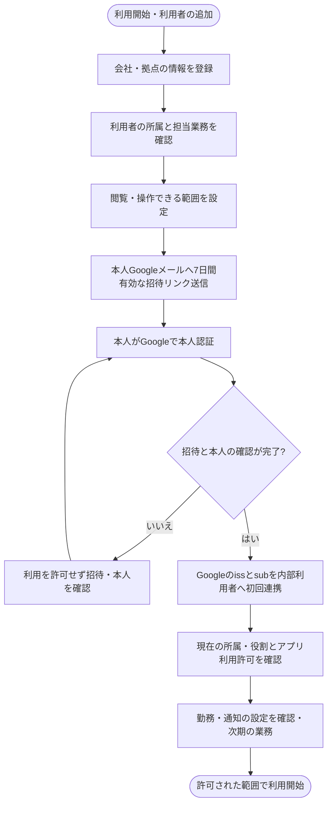
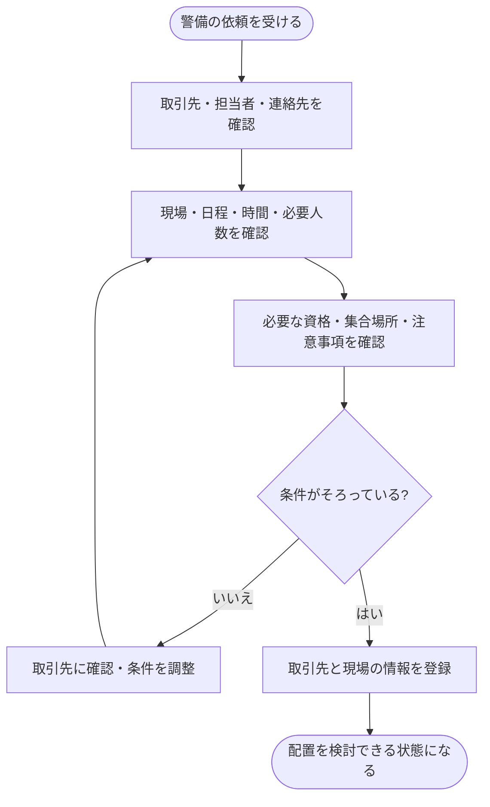
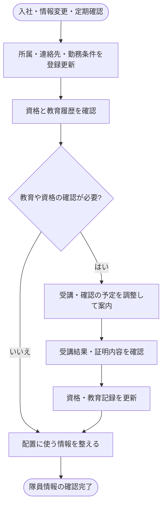
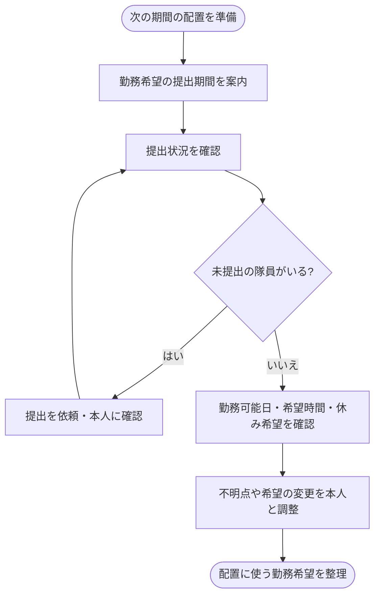
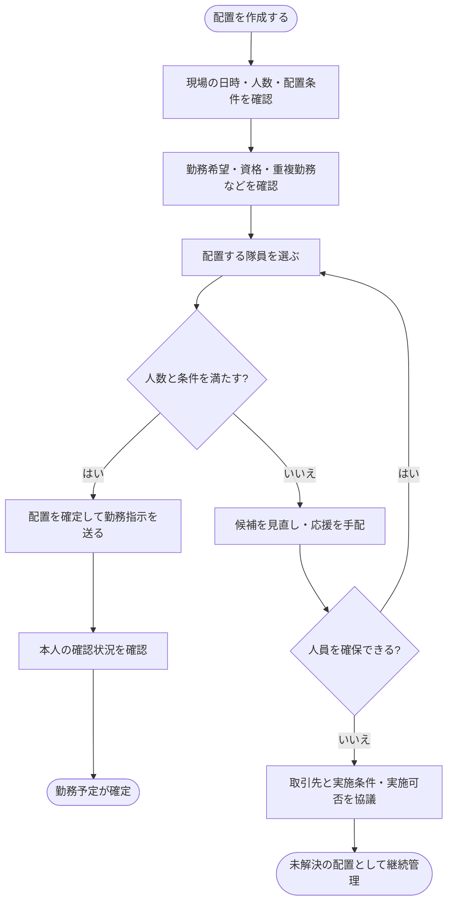
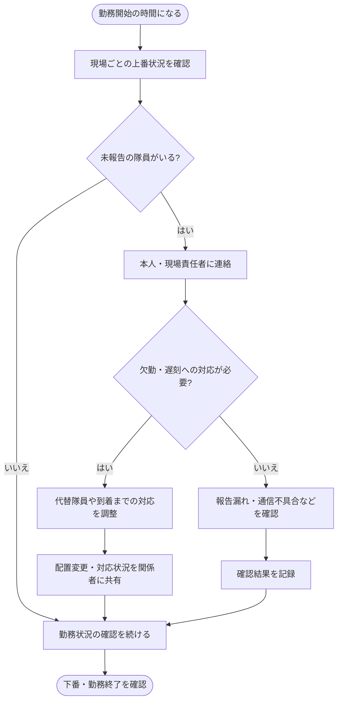
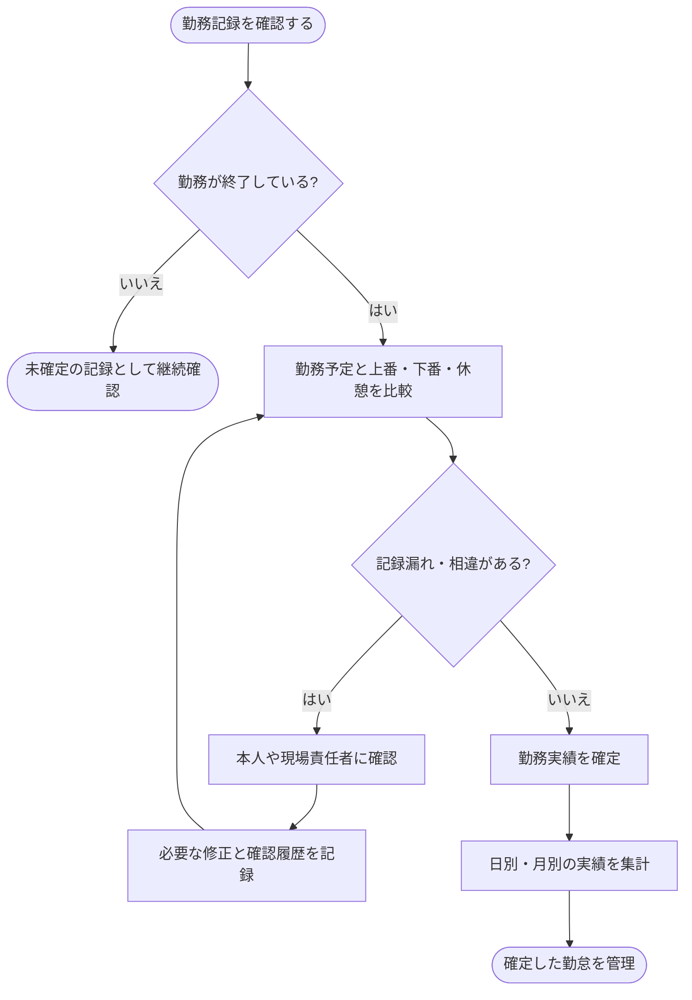
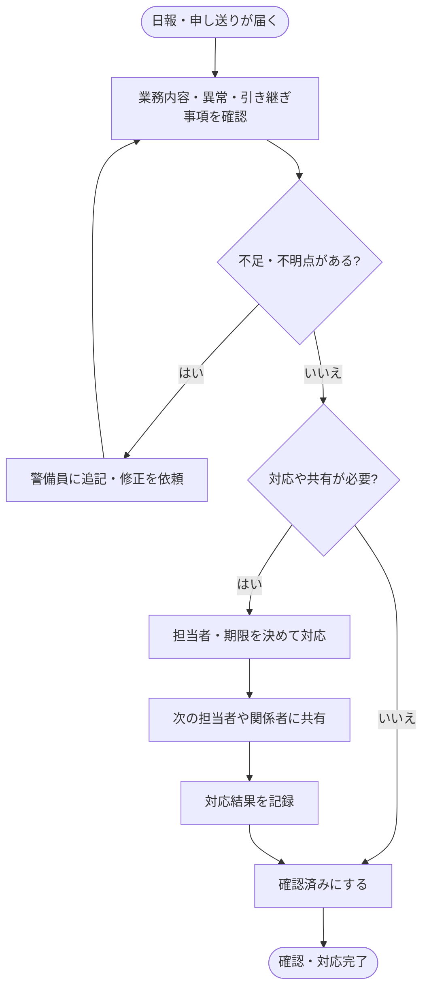
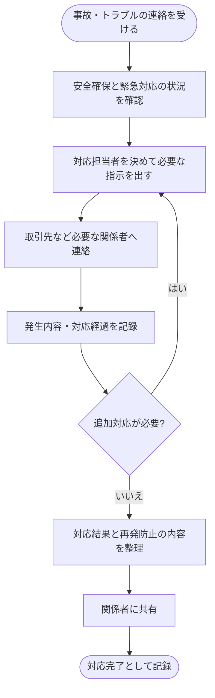
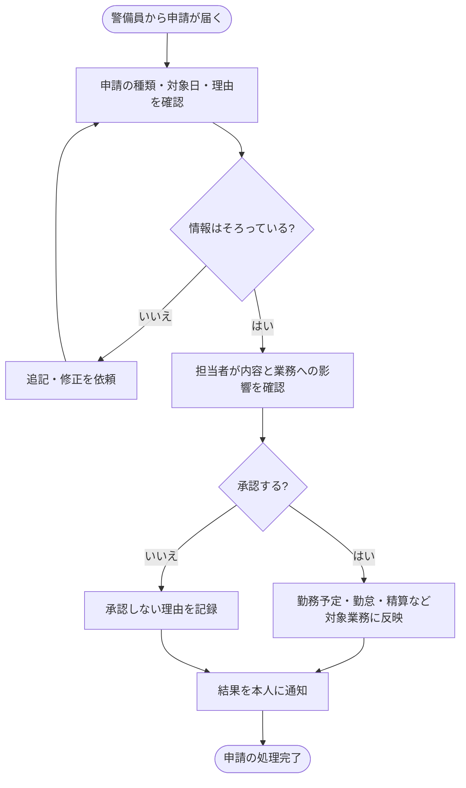

# 管理者向け 警備員管理システムの業務フロー案

作成日: 2026年10月7日

更新日: 2026年10月8日（Google招待・連携変更承認・管理者復旧の担当を反映）

管理者側は、誰を、いつ、どの現場に配置するかを決め、勤務と報告を確認します。ここでは会社の設定を行う管理者、配置を調整する管制担当、勤怠や申請を確認する事務担当などを含めています。実際の担当分担は会社によって決めます。

全体の流れは、仕事の登録 → 勤務希望の収集 → 配置の決定 → 現場での勤務 → 勤怠と報告の確認です。

以下は現在の画面構成を基にした業務フローの案です。現在のシステムはモック段階で、図にある登録・保存・提出・承認・通知は今後実装する操作を含みます。会社ごとの運用ルールや正式な権限仕様は、別途決める必要があります。

警備員本人の操作は、[警備員向け業務フロー](guard-workflows.md)を参照してください。現在の操作範囲は、[README](../../README.md)と[開発状況と実装ガイド](../DEVELOPMENT.md)に記載しています。

## 初回実装との対応（2026年10月8日追記）

以下の図は将来の全体業務を含む。初回の範囲は[要件書](../requirements/MVP_REQUIREMENTS.md)を優先し、判断が残る点は[実装前レビュー](../requirements/IMPLEMENTATION_READINESS.md)を参照する。この追記時点では資料の準備のみ。その後の依頼で[モックの照合・修正](../MOCK_REVIEW.md)を行ったが、図の保存・通知等の詳細機能は実装していない。

| この資料の業務 | 初回に扱う範囲 | 次期または既存手段で扱う範囲 |
| --- | --- | --- |
| 1 会社・拠点・利用者 | 各自のGoogleログイン、利用者事前登録/招待、会社境界、4役割。本店所属の会社管理者だけ支店追加/増枠 | 管制・勤怠設定、通知設定。初期会社・本店・管理者は限定した運営手順 |
| 2 取引先・現場 | 会社共通1件の取引先を各拠点の現場から参照。管制/閲覧者は自拠点に関係する取引先だけ閲覧。日別勤務の前提条件 | 契約書類保管・請求、正式な受注業務。共有取引先の編集担当は未確認 |
| 3 隊員・資格・教育 | 隊員基本情報と配置判断に必要な資格の確認 | 教育計画・受講・証明書保管は既存管理。法定記録を初回マスタで代替しない |
| 4 勤務希望 | 確定前に管制が勤務可能を別手段で確認し記録 | システムでの提出・依頼・承認は次期 |
| 5 配置 | 日別勤務枠・下書き・人数充足後の確定・改訂・取消・本人予定 | 指示の通知/既読・拠点間応援は初回対象外。図の送信/本人確認は既存連絡手段 |
| 6〜10 勤務状況・勤怠・報告・事故・申請 | 初回の確定予定の変更が必要なら配置の改訂・取消 | 打刻・実績・報告・事故受付・申請処理は次期。既存の記録・緊急連絡手順を継続 |

人数不足時は下書きの調整を行い、一部だけを本人へ公開しない。図の応援手配は会社の調整業務を示し、初回に他拠点の隊員を割り当てる権限を与えない。

## 用語と図の読み方

| 用語 | 意味 |
| --- | --- |
| 管制 | 警備員の配置や出勤状況を確認し、現場を調整する仕事 |
| 隊員 | このシステムでは警備員のこと |
| 配置 | 誰が、いつ、どの現場で働くかを決めること |
| 上番と下番 | 現場での勤務を開始することと終了すること |
| 勤怠 | 勤務開始・終了・休憩などの記録 |
| 申し送り | 次の担当者に伝える注意事項や引き継ぎ |

図は上から下へ読みます。四角は操作、ひし形は判断、丸い枠はきっかけや完了を表します。図はMermaid形式で記載しているため、GitHubやMermaid対応のMarkdownプレビューで表示できます。

## 1 会社と拠点と利用者を設定する

関連画面: 設定

全役割がGoogle OAuth 2.0＋OpenID Connectでログインする。方式はユーザー確認済みで、自システムにログインID・パスワード、TOTP・復旧コードを入力/保持/再設定する機能は設けない。[Google認証設計](../requirements/GOOGLE_AUTH_DESIGN.md)と[試験運用準備票](../requirements/PILOT_OPERATIONS.md)に、招待・連携変更・管理者交代等の詳細をまとめる。

管理者が登録・招待するのはアプリの利用者と利用許可であり、Googleアカウントは発行しない。内部利用者ID・会社・拠点・役割・隊員対応を管理者が決め、初回のGoogle本人認証と有効な招待を確認して検証済みの正規化iss＋subを一度だけ関連付ける。未招待は拒否し、メール一致だけで別Googleアカウントへ自動紐付けしない。許可アカウントは個人Gmailと会社Google Workspaceで確定し、非Gmailかつhdなしの外部メールGoogleアカウントは初回拒否する。追加本人確認は将来の許可拡張時に設計する。

通常の招待は会社管理者が本人Googleメールへリンクを送信する。リンクは発行から7日間有効で、再招待により旧リンクを無効にすることが確定した。最初の会社管理者は、運営者が会社・本人を確認して登録/招待する。不達・誤宛先時の対応や具体的な確認証跡等は引き続きD09で決める。

支店追加と登録枠増加は本店所属の会社管理者だけに許可することが確定した。支店所属の会社管理者は操作できない。一般の利用者招待・Google連携変更の承認を、本店所属条件へ一律に変更する回答ではない。

Googleのパスワード・二段階認証・回復はGoogle側へ案内する。会社管理者はGoogle側二段階認証を必須とし、管制・閲覧者・警備員は推奨する方針が確定した。Googleログイン成功を二段階認証済みの証拠にせず、技術的な確認/強制方法とamr等の情報欠落時の扱いは技術未決として今後決める。アプリの停止・退職・所属変更・権限縮小・Google連携変更では全アプリセッションを失効し、現在の所属/権限をAPI側で適用する。現在の招待・認証・停止ボタンは表示見本である。

Google連携変更は本人確認と会社管理者の承認を伴う。管理者本人の変更は自社の別の会社管理者が承認し、他にいなければ運営者へ依頼する。承認後に旧連携と全アプリセッションを失効し、新招待で再連携する。全会社管理者がログイン不能の場合のアプリ復旧/交代は、運営者が会社・本人を確認して対応する。Google側のパスワード回復とは別の手続きであり、本人確認の具体的な証跡・再有効化等の詳細手順はD09で今後決める。

アプリログイン期間は全役割共通で、本人操作なし24時間、継続操作しても最長1か月で失効する。ポーリング等の自動更新ではアイドル期限を延長しない。1か月の技術案は作成時点のJST翌月同日時（同日がない月は月末同時刻）としてUTC日時で管理し、本人操作でも絶対期限を延長しない。期限切れ後はGoogleで再ログインする。

## 2 取引先と現場を登録する

どの会社から、どこで、何人の警備を依頼されたかを整理します。

関連画面: 取引先管理・現場管理

取引先は会社共通の1件として管理し、各拠点の現場が同じ取引先IDを参照することが確定した。管制/閲覧者は所属拠点に関係する取引先だけ閲覧する。共有取引先の登録/編集を会社管理者だけに許可し管制は不可とする案は未確認のため、以下の「登録」は承認済み担当範囲を表すものではない。現場/隊員の異動後の過去履歴閲覧もD07で回答待ち。

新現場の候補は、会社管理者が取引先と拠点の利用関係を明示登録する技術案で制限する。管制/閲覧者は自拠点の有効な利用関係だけを取得し、現場0件でも事前許可された候補を利用できる。新支店へ全取引先を公開しない。利用関係の保存・登録方式をユーザー回答済みにはしない。

## 3 隊員情報と資格と教育を管理する

配置の判断に使えるように、警備員の情報を整えます。

関連画面: 隊員管理

教育予定を管理する独立した画面は、現在はありません。

## 4 勤務希望を集める

警備員が働ける日や時間を把握します。勤務希望を出しただけでは、勤務する現場は確定しません。

関連画面: シフト・勤務希望

## 5 警備員を現場に配置する

現場の条件と、警備員の勤務希望・資格などを照らし合わせます。

関連画面: 配置・管理・シフト・勤務希望・隊員管理

## 6 当日の勤務状況を確認する

上番報告がないときは、まず本人の状況を確認します。報告漏れと欠勤を区別することが必要です。

関連画面: ダッシュボード・勤怠管理・配置・管理

## 7 勤怠を確認し修正して確定する

勤務予定と実際の勤務を比較し、打刻漏れや休憩時間などを確認します。勤務中の記録は未確定として扱い、下番後に勤務実績を確認します。

関連画面: 勤怠管理

## 8 日報と申し送りを確認する

読むだけで終わらせず、対応が必要な内容には担当者を決めます。

関連画面: 日報・申し送り

## 9 事故とトラブルに対応する

緊急時の連絡や現場対応と、システムへの記録を組み合わせます。

関連画面: 日報・申し送り・現場管理

## 10 各種申請を処理する

休暇・勤務変更・打刻修正・経費など、申請の種類に応じて担当者と処理方法を変えます。

関連画面: シフト・勤務希望・勤怠管理

管理者向けの統一した申請一覧と、正式な経費精算機能は未作成です。

## 今後の追加業務

給与計算・給与明細・取引先への請求・備品管理は、現在のモックに含まれていない追加業務です。これらを扱う場合は、担当者、入力情報、確認手順、外部サービスとの連携を別途整理します。
