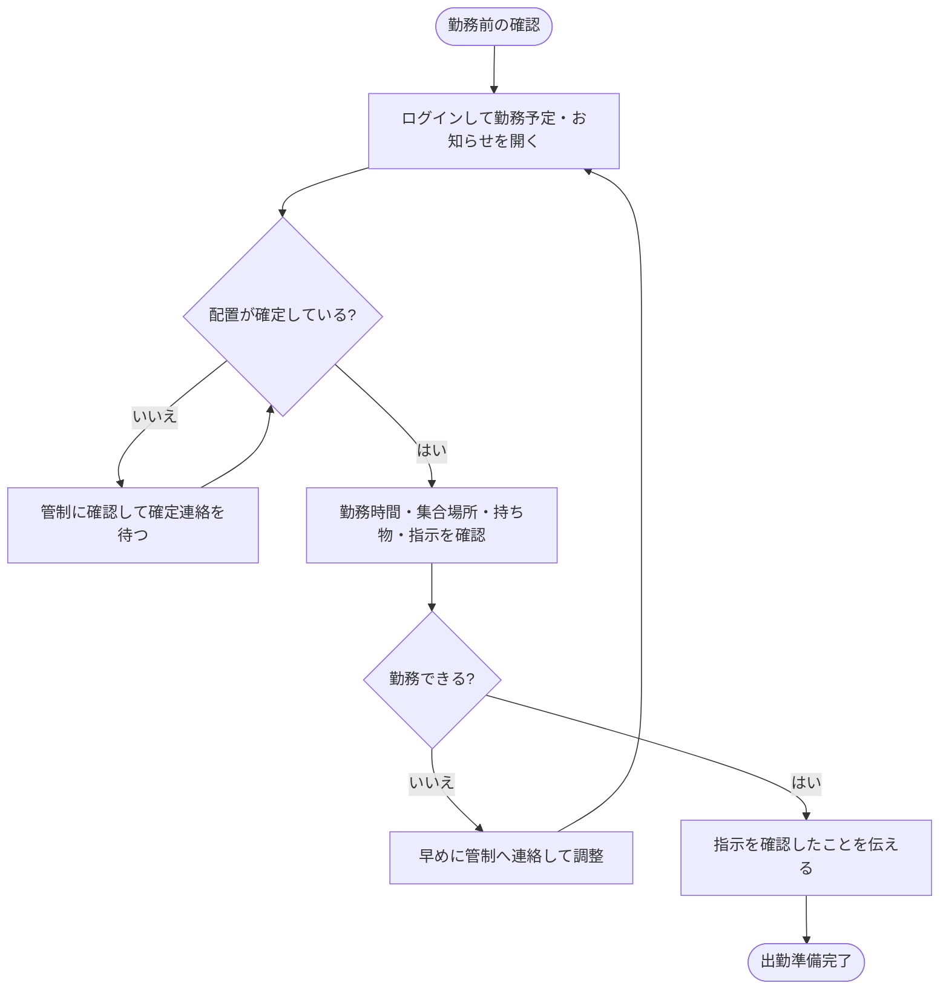
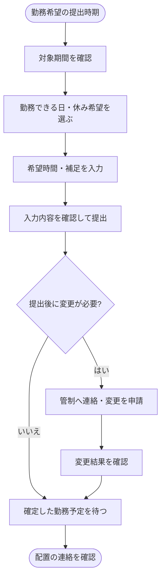
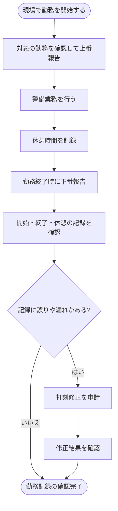
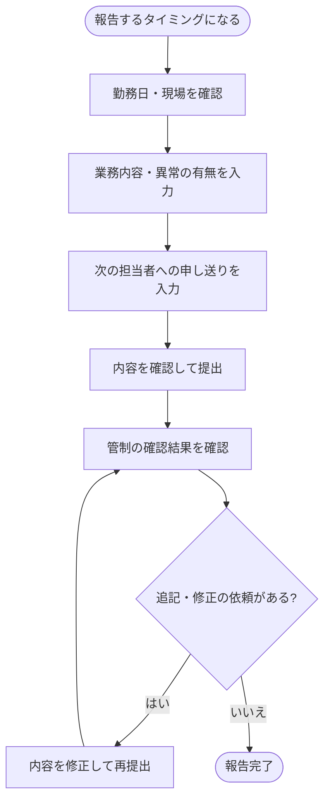
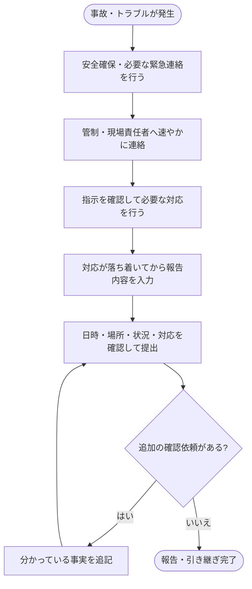
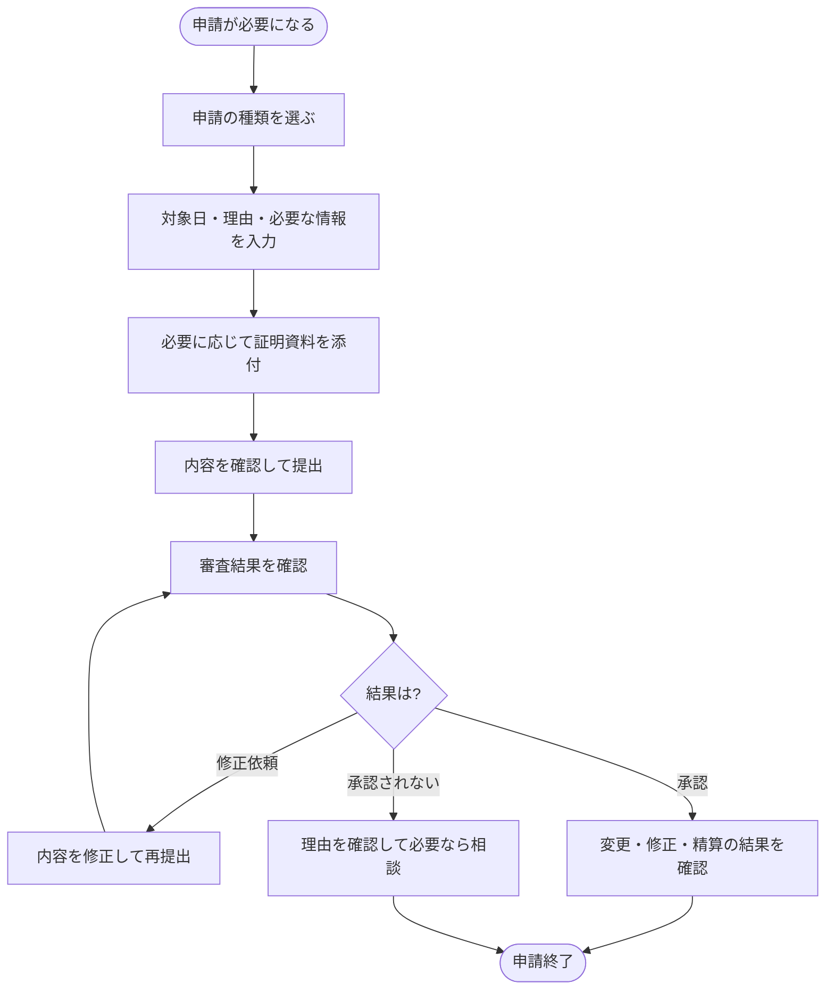
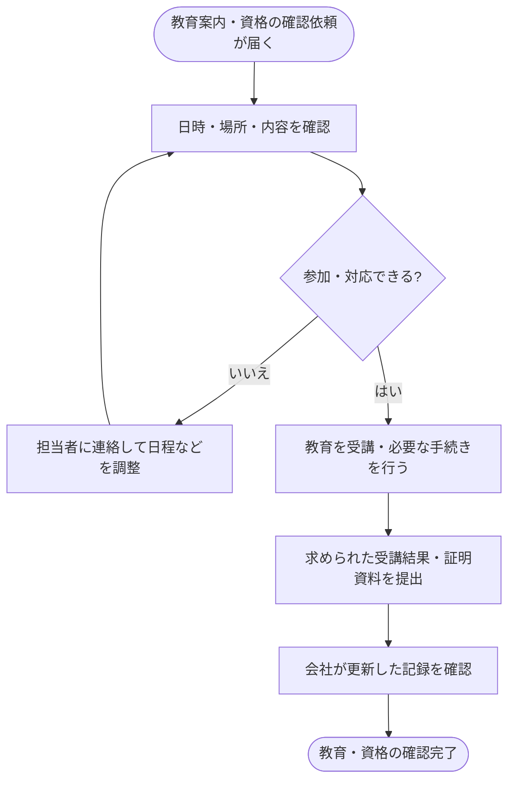
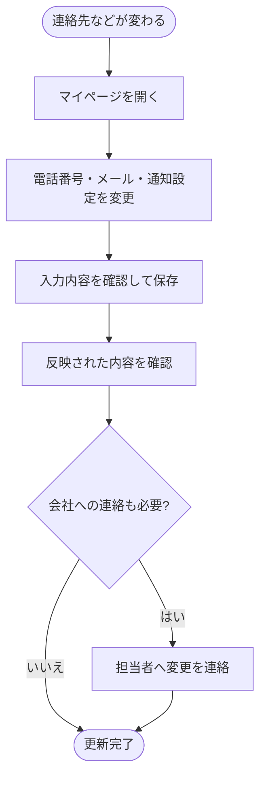

# 警備員向け 警備員管理システムの業務フロー案

作成日: 2026年10月7日

警備員本人は、勤務希望を伝え、指示された現場で勤務し、勤務実績と業務内容を報告します。

全体の流れは、勤務希望の提出 → 確定した勤務予定の確認 → 現場での勤務 → 出退勤と日報の報告 → 管制の確認結果の確認です。

以下は現在の画面構成を基にした業務フローの案です。現在のシステムはモック段階で、図にあるログイン・打刻・保存・提出・通知は今後実装する操作を含みます。会社ごとの報告方法や申請ルールは、別途決める必要があります。

管理者や管制担当の操作は、[管理者向け業務フロー](admin-workflows.md)を参照してください。現在の操作範囲は、[README](../../README.md)と[開発状況と実装ガイド](../DEVELOPMENT.md)に記載しています。

## 初回実装との対応（2026年10月8日追記）

以下の図は将来の全体業務を含む。初回の範囲・本人の権限は[要件書](../requirements/MVP_REQUIREMENTS.md)を優先し、[画面仕様](../requirements/MVP_SCREEN_SPEC.md)と[実装前レビュー](../requirements/IMPLEMENTATION_READINESS.md)を参照する。この追記時点では資料の準備のみ。その後の依頼で[モックの照合・修正](../MOCK_REVIEW.md)を行ったが、図の保存・打刻・通知等の詳細機能は実装していない。

| この資料の業務 | 初回に扱う範囲 | 次期または既存手段で扱う範囲 |
| --- | --- | --- |
| 1 勤務予定と指示の確認 | 個別ログイン、本人の確定予定・変更/取消概要、許可された勤務の現場情報 | お知らせ・既読/確認送信は次期。勤務可否や指示確認は既存の連絡手段 |
| 2〜6 希望・出退勤・報告・事故・申請 | 確定勤務の変更が必要なら管制へ既存手段で連絡 | システムでの提出・打刻・修正・添付・承認は次期。事故は既存の緊急連絡/記録手順 |
| 7 教育と資格 | 本人の資格基本情報の閲覧 | 研修予定・参加回答・受講管理・証明書/資料配信は次期、既存管理を継続 |
| 8 本人情報と通知設定 | 本人基本情報の閲覧、認証情報の変更・ログアウト | 隊員連絡先の直接編集と通知設定は初回対象外。訂正は管理者/管制に依頼 |

勤務希望・下書きは確定予定ではない。図の「指示を確認したことを伝える」は、初回にシステムの既読や承認を保存する意味ではない。

## 用語と図の読み方

| 用語 | 意味 |
| --- | --- |
| 管制 | 警備員の配置や出勤状況を確認し、現場を調整する担当者や仕事 |
| 配置 | 誰が、いつ、どの現場で働くかを決めること |
| 勤務希望 | 本人が申告する、働ける日・時間や休みの希望 |
| 勤務予定 | 会社から指示された、確定した勤務の予定 |
| 上番と下番 | 現場での勤務を開始することと終了すること |
| 打刻 | 勤務の開始・終了などの時刻を記録すること |
| 申し送り | 次の担当者に伝える注意事項や引き継ぎ |

図は上から下へ読みます。四角は操作、ひし形は判断、丸い枠はきっかけや完了を表します。図はMermaid形式で記載しているため、GitHubやMermaid対応のMarkdownプレビューで表示できます。

## 1 勤務予定と現場の指示を確認する

出勤前に、現場・時間・集合場所・持ち物を確認します。勤務希望を提出しただけでは、勤務する現場は確定しません。

関連画面: ログイン・ホーム・勤務予定・現場情報・お知らせ

## 2 勤務希望を提出する

働ける日・時間と休み希望を会社に伝えます。

関連画面: 勤務希望

## 3 上番と休憩と下番を記録する

実際に勤務した内容を記録します。日付をまたぐ夜勤では、終了日の確認も必要です。

関連画面: 出退勤・勤務実績

## 4 日報と申し送りを提出する

その日に行った仕事と、次の担当者が知っておくべきことを伝えます。

関連画面: 日報・申し送り・日報入力

## 5 事故とトラブルを連絡して報告する

緊急時は、安全確保と必要な連絡を先に行います。システムへの入力は、対応状況を記録するために使います。

関連画面: 事故・トラブル報告・連絡先・ヘルプ

## 6 各種申請を提出する

休暇・勤務変更・打刻修正・経費など、会社の判断や処理が必要な内容を申請します。

関連画面: 各種申請

現在のファイル選択は、選択したファイル名の確認のみです。資料のアップロードと保管、正式な経費精算は未実装です。

## 7 教育予定と資格を確認する

受講する予定や、会社に登録されている資格情報を確認します。

関連画面: 教育・資格・お知らせ

現在の研修予定・資料名は表示例で、研修回答や資料配信は未実装です。

## 8 本人の連絡先と通知設定を更新する

会社が本人に連絡できる状態を保ちます。

関連画面: マイページ

## 今後の追加業務

給与明細の確認や正式な経費精算などは、現在のモックに含まれていない追加業務です。これらを扱う場合は、会社の運用と管理者側の処理に合わせて流れを整理します。
